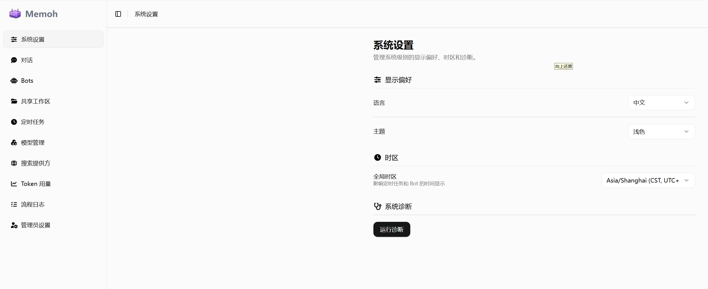

<div align="center">

# Memoh-v2

**Containerized · Structured Long-Memory · Self-Evolving AI Agent System**

[](LICENSE)
[](https://go.dev)
[](https://vuejs.org)
[](https://docs.docker.com/compose/)

Each bot gets its own container, memory, skills, and self-evolution — your personal AI agent platform.

[中文](./README.md) · [Feature Guide](./doc/features_en.md) · [Installation](./doc/installation_en.md) · [Tutorials](./doc/README.md) · [Screenshots](./doc/screenshots.md)

</div>

---

## Quick Start

**Requires Docker:**

```bash
curl -fsSL https://raw.githubusercontent.com/Kxiandaoyan/Memoh-v2/main/scripts/install.sh | sh
```

> Silent install (skip prompts): `curl -fsSL ... | sh -s -- -y`

Or manually:

```bash
git clone --depth 1 https://github.com/Kxiandaoyan/Memoh-v2.git
cd Memoh-v2
docker compose up -d
```

Visit **http://localhost:8082**. Default login: `admin` / `admin123`

After installation, configure in this order:

```
1. Settings -> Provider    Add API provider, enter API Key and Base URL
       |
2. Provider -> Models      Add models (chat or embedding type)
       |
3. New Bot                 Select a template or start blank, set name and type
       |
4. Bot -> Settings         Choose Chat model, Embedding model, language, etc.
       |
5. Bot -> Channels         Connect Telegram / Lark messaging platforms (optional)
```

> For detailed installation, upgrade, uninstall, and data migration guides, see **[Installation & Upgrade](./doc/installation_en.md)**.

---

## Architecture Overview

```
                    ┌──────────────┐
                    │   Web UI     │ :8082
                    │  Vue 3       │
                    └──────┬───────┘
                           │
              ┌────────────┼────────────┐
              │            │            │
      ┌───────▼──────┐ ┌──▼──────────┐ │
      │   Server     │ │ Agent       │ │
      │   Go + Echo  │ │ Gateway     │ │
      │   :8080      │ │ Bun + Elysia│ │
      └──┬────┬──────┘ │ :8081       │ │
         │    │         └──┬──────────┘ │
         │    │            │            │
    ┌────▼┐ ┌─▼─────┐  ┌──▼──────────┐ │
    │ PG  │ │Qdrant │  │ Containerd  │◄┘
    │     │ │       │  │ (per-bot    │
    │     │ │       │  │  containers)│
    └─────┘ └───────┘  └─────────────┘
```

| Service | Responsibility |
|---|---|
| **Server** (Go) | REST API, auth, database, container management, conversation routing, memory retrieval |
| **Agent Gateway** (Bun) | AI inference, system prompt assembly, tool execution, streaming, subagent dispatch |
| **Web** (Vue 3) | Management UI: bots, models, channels, skills, files, evolution, heartbeat visualization |
| **PostgreSQL** | Relational data (users, bots, messages, configs, evolution logs) |
| **Qdrant** | Vector database (memory semantic search) |
| **Containerd** | Container runtime (one isolated container per bot) |

---

## Screenshot Preview

<p align="center">
  
</p>

<p align="center">
  <a href="./doc/screenshots.md">👉 Click for more screenshots</a>
</p>

---

## Core Features

> Full details for each feature in the **[Feature Guide](./doc/features_en.md)**.

- **Bot Management & Templates** — 13 mental-model templates (10 real thought-leaders), two-step professional bot creation
- **Conversation & Streaming** — SSE real-time streaming + synchronous modes, automatic context management and memory recall
- **Three-Layer Memory** — Vector semantic search + BM25 keywords + LLM smart extraction, auto-indexed after each turn
- **Isolated Container Sandbox** — Each bot gets a containerd container with file I/O, shell, browser, and snapshot rollback
- **Multi-Platform Channels** — Telegram / Lark / Web chat / CLI with cross-platform identity unification
- **MCP Tool System** — 15 built-in tools + any external MCP server, Stdio and Remote transport
- **Heartbeat & Scheduling** — Periodic + event-driven dual-mode triggers; bots act proactively
- **Self-Evolution** — Three-phase organic cycle (Reflect / Experiment / Review) with full evolution log tracking
- **Subagents & Skills** — Auto-dispatched subagents, one-click skill install from ClawHub marketplace
- **OpenViking Tiered Context** — L0/L1/L2 structured memory layers, dramatically reducing token consumption
- **Token Usage & Diagnostics** — Dashboard charts + multi-bot comparison, one-click service health check
- **Cross-Bot Collaboration** — `/shared` workspace with file-based coordination

---

## Documentation

| Document | Description |
|----------|-------------|
| **[Feature Guide](./doc/features_en.md)** | Full details on all 12 core features |
| **[Concepts Guide](./doc/concepts_en.md)** | Model types, persona system, Provider configuration |
| **[Installation & Upgrade](./doc/installation_en.md)** | Install / upgrade / uninstall / data migration |
| **[Known Limitations](./doc/known-limitations_en.md)** | Current shortcomings and workarounds |
| **[OpenClaw Comparison](./doc/comparison_en.md)** | 42-item comprehensive comparison |
| **[Tutorials](./doc/README.md)** | 18 step-by-step tutorials (quick start to advanced tips) |
| **[Screenshots](./doc/screenshots.md)** | More UI screenshots |
| **[Feature Audit](./doc/FEATURE_AUDIT.md)** | 74-item feature audit |
| **[Prompts Inventory](./doc/PROMPTS_INVENTORY.md)** | Complete prompts reference |

---

## Tech Stack

| Service | Stack | Port |
|---|---|---|
| Server (Backend) | Go + Echo + Uber FX + pgx/v5 + sqlc | 8080 |
| Agent Gateway | Bun + Elysia + Vercel AI SDK | 8081 |
| Web (Frontend) | Vue 3 + Vite + Tailwind CSS + Pinia | 8082 |

| Dependency | Version | Purpose |
|-----------|---------|---------|
| PostgreSQL | 18 | Relational data storage |
| Qdrant | latest | Vector database |
| Containerd | v2 | Container runtime |

---

## Acknowledgments

This project is a secondary development based on [Memoh](https://github.com/memohai/Memoh). Thanks to the original authors for their excellent work.
